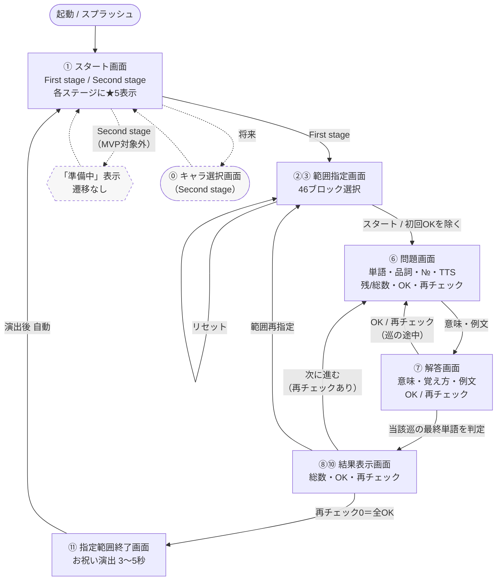
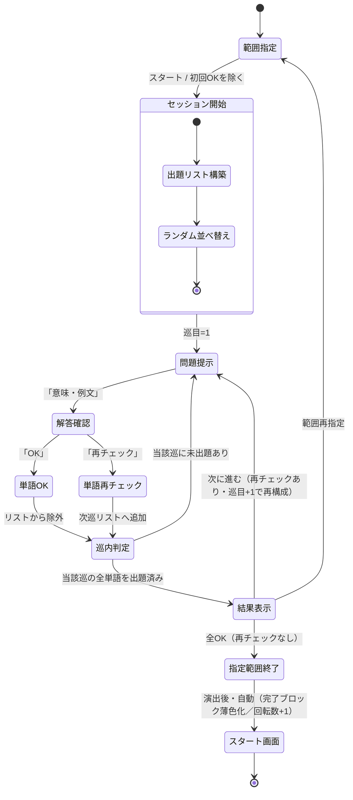
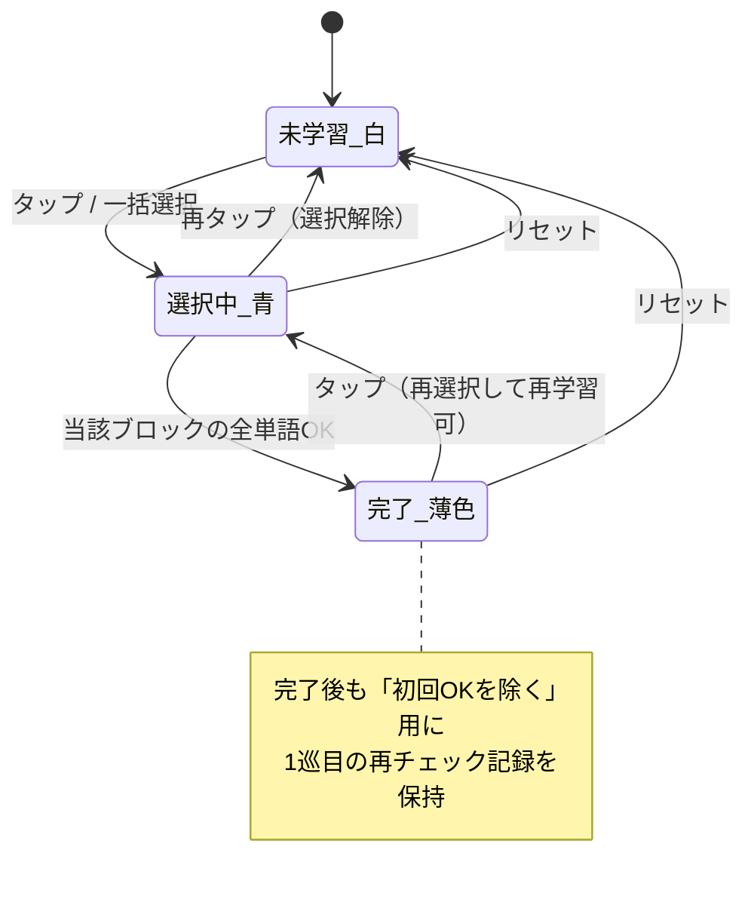

# 快単 英単語記憶アプリ　画面遷移図（MVP / First stage）

|項目|内容|
|---|---|
|バージョン|v1.0（仕様確定フェーズ・ご確認用）|
|作成日|2026年5月22日|
|宛先|一般社団法人KAI　菊地雅文 様|
|関連文書|`01_快単_詳細仕様書_v1.0.md` / `03_快単_ER図_v1.0.md`|

> 本図は解説書の画面番号（①〜⑪）に準拠し、MVP（First stage）の画面遷移を示します。Second stage・育成キャラクター（⓪/⑫）は対象外のため**点線**で参考表示しています。
> 💡 図はMermaid記法で作成しています。GitHub・対応ビューアでは図として表示されます。

---

## 1. 全体遷移図（俯瞰）

---

## 2. 学習セッションの状態遷移（満点法ロジック）

問題⇄解答の往復と巡目進行を、ステートマシンとして表現します。

---

## 3. 範囲指定画面のブロック状態遷移

---

## 4. 画面遷移一覧（表）

|遷移元|操作・条件|遷移先|
|---|---|---|
|起動|スプラッシュ後|① スタート画面|
|① スタート|First stage|②③ 範囲指定|
|① スタート|Second stage（MVP）|「準備中」表示（遷移なし）|
|②③ 範囲指定|ブロックタップ|（選択状態変化・同画面）|
|②③ 範囲指定|リセット|（白に戻す・同画面）|
|②③ 範囲指定|スタート／初回OKを除く|⑥ 問題画面|
|⑥ 問題画面|意味・例文|⑦ 解答画面|
|⑥ 問題画面|スピーカー|（TTS再生・同画面）|
|⑦ 解答画面|OK／再チェック（巡の途中）|⑥ 問題画面（次の単語）|
|⑦ 解答画面|OK／再チェック（巡の最終単語）|⑧⑩ 結果表示画面|
|⑧⑩ 結果表示|次に進む（再チェックあり）|⑥ 問題画面（次巡）|
|⑧⑩ 結果表示|範囲再指定|②③ 範囲指定画面|
|⑧⑩ 結果表示|再チェック0（全OK）|⑪ 指定範囲終了画面|
|⑪ 指定範囲終了|演出後（自動）|① スタート画面|

---

## 5. 注記

- ⑥問題画面 ⇄ ⑦解答画面 の往復は、操作速度を最優先するため**遷移アニメーションを実質無し（100ms以下）**とする。実装上は1画面内での表示切替とし、Navigatorの遷移負荷を排除する。
- ⓪キャラ選択画面・⑫Second stageは本MVPの**対象外**（点線表記）。将来同一フレームワーク上で追加する。
- 46ブロック全完了時も①スタート画面へ戻り、星評価が1回転分進む（詳細は仕様書「8. 星評価」）。

---

## 6. 変更履歴

|版|日付|内容|
|---|---|---|
|v1.0|2026-05-22|初版（仕様確定フェーズ・ご確認用）|
