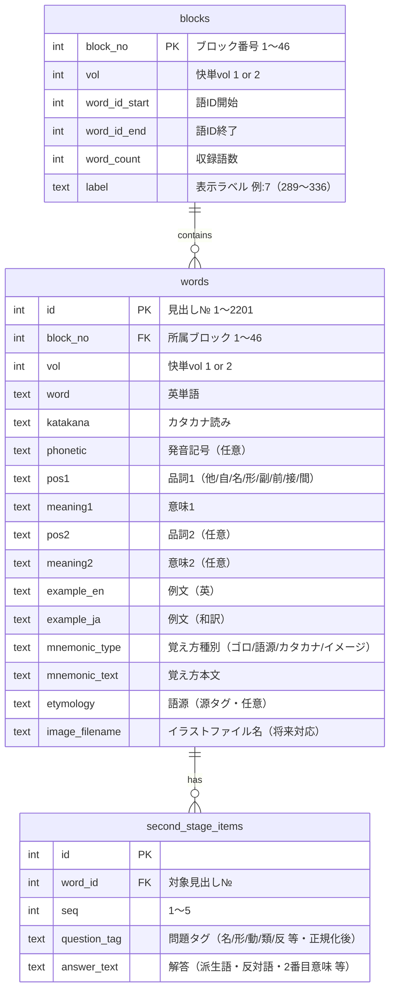
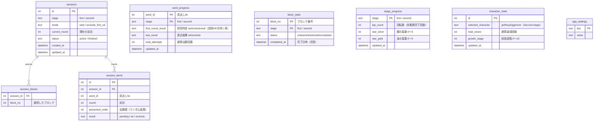

# 快単 英単語記憶アプリ　ER図（データベース設計 / MVP）

|項目|内容|
|---|---|
|バージョン|v1.0（仕様確定フェーズ・ご確認用）|
|作成日|2026年5月22日|
|宛先|一般社団法人KAI　菊地雅文 様|
|DB|SQLite（端末内・オフライン）|
|関連文書|`01_快単_詳細仕様書_v1.0.md` / `02_快単_画面遷移図_v1.0.md`|

> 💡 **設計方針：データを2つに分離します。**
> - **① 単語マスタDB（`content.db`）**：2,201語などの教材データ。**読み取り専用**でアプリに同梱。将来「英検1級3000語」等を追加する際は、このDBを差し替えるだけで済みます。
> - **② 学習履歴DB（`progress.db`）**：利用者の学習状況。**書き込み可能**。教材を差し替えても利用者の履歴は影響を受けません。
>
> この分離により、**教材の拡張（拡張性）と利用者データの保護（安定性・保守性）を両立**します。

---

## 1. 単語マスタDB（`content.db`／読み取り専用・同梱）



> `second_stage_items` は基本データExcelの「問題1〜5／解答1〜5」を正規化（1行1項目化）したものです。**Second stage向けのため、データは保持しますがMVPでは未使用**です。

---

## 2. 学習履歴DB（`progress.db`／書き込み可能）



> `character_state` はSecond stageの育成キャラクター用です。**MVPでは未使用**ですが、将来拡張のためスキーマを用意しておきます。

---

## 3. 主要テーブルの役割

|DB|テーブル|役割|MVP|
|---|---|---|:---:|
|content|`words`|2,201語の単語マスタ|✅|
|content|`blocks`|46ブロックの定義（語ID範囲）|✅|
|content|`second_stage_items`|Second stage出題項目（保持のみ）|データのみ|
|progress|`word_progress`|単語ごとの学習履歴・**初回判定**|✅|
|progress|`block_state`|ブロックの状態（未学習/選択/完了）|✅|
|progress|`sessions`|学習セッション（巡目・モード・中断再開）|✅|
|progress|`session_blocks`|セッションで選択したブロック|✅|
|progress|`session_items`|セッション内の各単語の巡別結果|✅|
|progress|`stage_progress`|ステージごとの回転数・星評価|✅|
|progress|`character_state`|育成キャラ状態|❌（将来）|
|progress|`app_settings`|各種設定（選択ステージ等）|✅|

---

## 4. 主要機能とデータの対応

|機能|使用テーブル|処理概要|
|---|---|---|
|範囲指定・ブロック色|`blocks` / `block_state`|状態に応じて白/青/薄色を表示|
|満点法（巡目進行）|`sessions` / `session_items`|当該巡の`result`を集計し、`recheck`のみで次巡を構成|
|残/総数・OK・再チェック表示|`session_items`|`round=current_round`を`result`で集計|
|**初回OKを除く**|`words`(選択ブロック) × `word_progress.first_round_result`|選択範囲の語から、初回`ok`の語を差し引いて出題（💡 SQLの差集合）|
|中断・再開|`sessions`(status=active) / `session_items`|`status=active`のセッションと巡内進捗を復元|
|星評価|`stage_progress`|`lap_count`から銀/金の星数を算出|
|完了状態の保持|`block_state` / `word_progress`|⑪終了時に完了化、再チェック記録は保持|

---

## 5. 「初回OKを除く」のデータ処理イメージ（参考）

```sql
-- 選択ブロックの単語のうち、初回にOK済みの語を除外して出題対象を得る
SELECT w.id
FROM content.words w
WHERE w.block_no IN (/* 選択ブロック */)
  AND w.id NOT IN (
        SELECT p.word_id
        FROM progress.word_progress p
        WHERE p.stage = 'first'
          AND p.first_round_result = 'ok'
      );
```

> このような関係検索（差集合）を簡潔・確実に記述できることが、本案件でSQLite（drift）を採用する主たる理由です。

---

## 6. 設計上の留意点

- **ブロック番号は語ID（見出し№）から自動算出**し、`blocks`に確定値として保持します（基本データExcelの「P番号」列は使用しません。仕様書ご確認事項 Q-2）。
  - vol.1：`block = ceil(id / 48)`（1〜23）
  - vol.2：`block = 23 + ceil((id − 1100) / 48)`（24〜46）
- `word_progress`・`block_state`は **(対象, stage) の複合キー**とし、First/Second stageの履歴を独立管理します。
- スキーマ変更時も学習履歴を失わないよう、drift のマイグレーション機能で版管理します。
- 単語マスタ更新（教材差し替え）と学習履歴は物理的に別DBとし、相互に影響しません。

---

## 7. 変更履歴

|版|日付|内容|
|---|---|---|
|v1.0|2026-05-22|初版（仕様確定フェーズ・ご確認用）|
